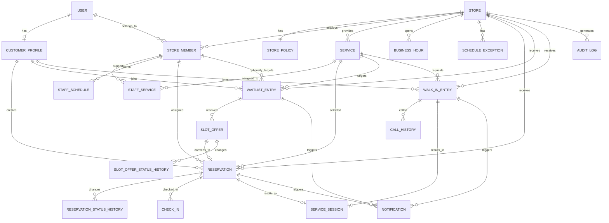
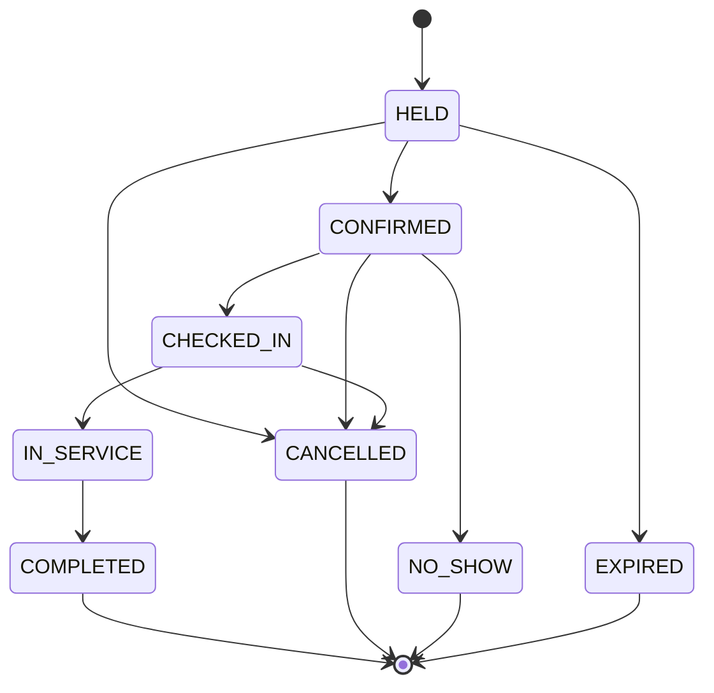
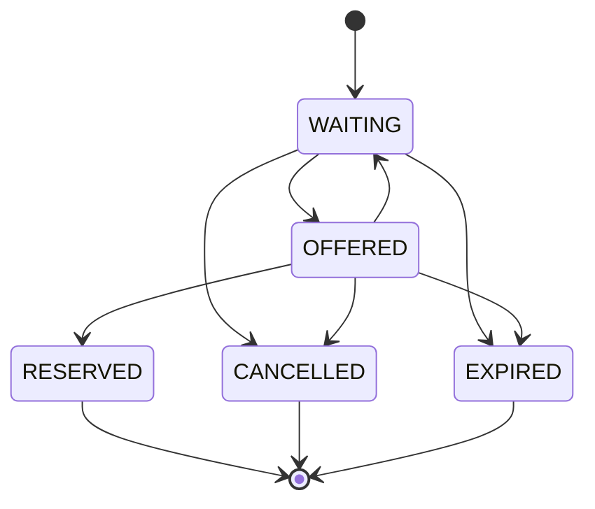
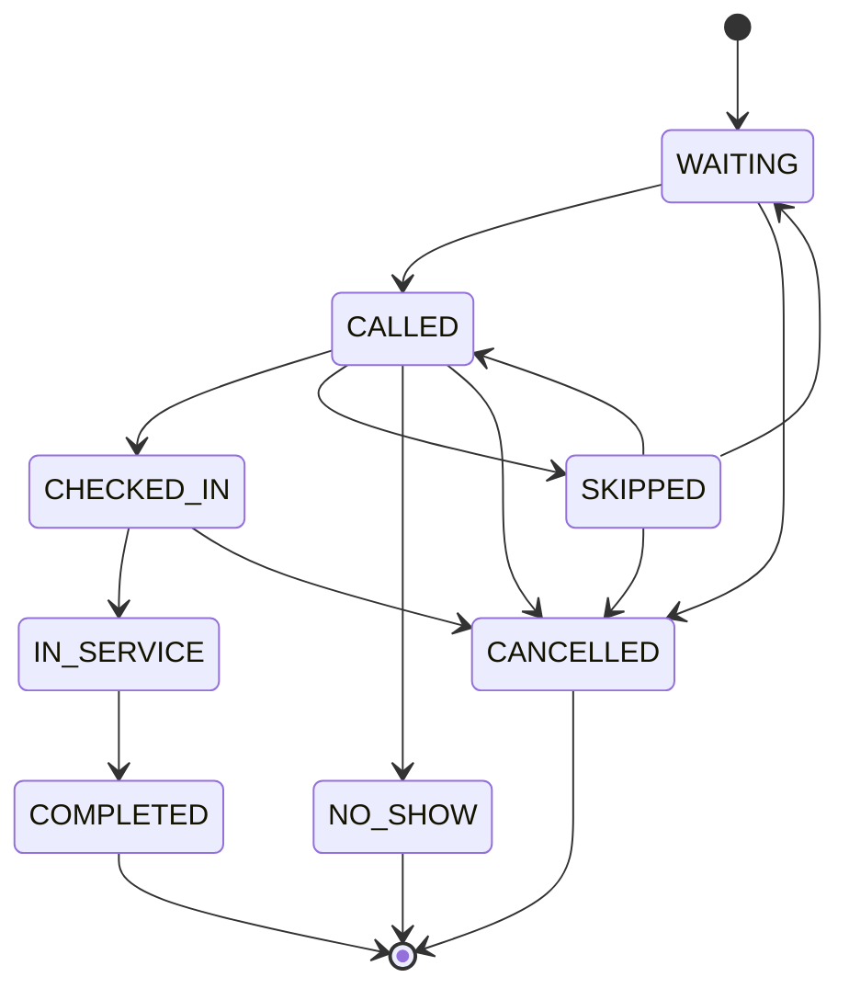

# 자리요 데이터 모델 설계

## 1. 설계 목표

자리요의 데이터 모델은 다음 상황에서도 상태가 모순되지 않아야 한다.

* 여러 고객이 같은 시간대를 동시에 예약한다.
* 고객이 예약 요청을 반복해서 전송한다.
* 예약 취소와 대기 고객 승격이 동시에 발생한다.
* 빈자리 제안을 여러 고객이나 직원이 동시에 처리한다.
* 예약 고객과 현장 대기 고객을 같은 운영 화면에서 관리한다.
* 직원 여러 명이 같은 고객의 상태를 동시에 변경한다.
* 체크인, 호출, 서비스 시작, 완료가 중복 요청된다.
* 자동 만료 처리와 사용자의 수락 요청이 동시에 발생한다.
* 알림이 실패해도 예약과 대기 상태는 유지된다.
* 모든 주요 상태 변경의 원인과 담당자를 추적할 수 있다.

핵심 원칙은 다음과 같다.

1. 예약과 대기는 서로 다른 생명주기를 가진다.
2. 예약 상태와 실제 서비스 진행 상태를 구분한다.
3. 예약 가능한 시간은 별도 데이터로 미리 저장하기보다 일정과 기존 예약을 기반으로 계산한다.
4. 중요한 상태 변경은 현재 상태를 확인한 뒤 허용된 경우에만 수행한다.
5. 알림 성공 여부는 예약 성공 여부와 분리한다.
6. 모든 주요 변경은 이력으로 남긴다.
7. 삭제보다 비활성화와 상태 변경을 우선한다.

---

# 2. 핵심 도메인 구성

자리요의 핵심 도메인은 크게 여섯 영역으로 나눈다.

## 매장 운영

* 매장
* 매장 운영 정책
* 직원
* 서비스
* 직원별 근무 일정
* 휴무 및 일정 예외

## 고객

* 고객
* 고객별 매장 이용 정보
* 고객 연락 수단

## 예약

* 예약
* 예약 대상 자원
* 예약 상태 이력
* 중복 요청 방지 정보

## 예약 대기

* 예약 대기 신청
* 빈자리 제안
* 대기 상태 이력

## 현장 대기와 이용

* 현장 대기
* 호출 이력
* 체크인
* 서비스 이용 세션

## 운영 지원

* 알림
* 감사 로그
* 비동기 작업
* 이벤트 발행 기록

---

# 3. 전체 관계 개요



---

# 4. 사용자와 권한 모델

## 4.1 User

로그인 가능한 모든 사용자의 공통 계정이다.

```text
user
- id
- email
- phone_number
- password_hash
- status
- created_at
- updated_at
- last_login_at
```

### status

```text
ACTIVE
SUSPENDED
WITHDRAWN
```

### 설계 이유

고객과 매장 직원을 완전히 별도 계정으로 분리하면 한 사람이 고객이면서 동시에 매장 직원인 상황을 처리하기 어렵다.

로그인 계정은 `user`로 통합하고, 역할별 세부 정보는 별도 모델로 분리한다.

---

## 4.2 CustomerProfile

고객 역할에 필요한 정보를 저장한다.

```text
customer_profile
- id
- user_id
- display_name
- marketing_consent
- notification_consent
- created_at
- updated_at
```

### 제약

* 하나의 사용자 계정은 최대 하나의 고객 프로필을 가진다.
* 탈퇴한 고객의 과거 예약 기록은 삭제하지 않고 익명화할 수 있다.

---

## 4.3 StoreMember

매장 관리자와 직원을 표현한다.

```text
store_member
- id
- store_id
- user_id
- role
- display_name
- status
- booking_enabled
- created_at
- updated_at
```

### role

```text
OWNER
MANAGER
STAFF
```

### status

```text
ACTIVE
ON_LEAVE
INACTIVE
```

### booking_enabled

고객이 해당 직원을 예약 대상으로 선택할 수 있는지 나타낸다.

관리자 계정이지만 실제 서비스를 수행하지 않는 경우 `false`다.

### 주요 제약

* 같은 사용자는 한 매장에 하나의 활성 멤버십만 가진다.
* 비활성 직원에게 새로운 예약을 배정할 수 없다.
* 기존 예약과 이력은 직원 비활성화 이후에도 유지한다.

---

## 4.4 RefreshToken

로그인 세션별 Refresh Token의 회전과 폐기 이력을 저장한다.

```text
refresh_token
- id
- user_id
- family_id
- token_hash
- status
- expires_at
- used_at
- replaced_by_token_id
- revoked_at
- created_at
```

### status

```text
ACTIVE
ROTATED
REVOKED
REUSED
```

### 주요 제약

* 토큰 원문은 저장하지 않고 SHA-256 해시만 저장한다.
* 같은 토큰 해시는 하나만 존재한다.
* 재발급 시 기존 토큰을 `ROTATED`로 변경하고 같은 `family_id`로 새 토큰을 만든다.
* 이미 회전된 토큰이 다시 사용되면 해당 토큰을 `REUSED`로 기록하고 같은 패밀리의 토큰을 모두 폐기한다.
* 로그아웃 시 현재 토큰이 속한 패밀리를 폐기한다.

---

# 5. 매장 모델

## 5.1 Store

하나의 독립적인 예약·대기 운영 단위다.

```text
store
- id
- name
- description
- phone_number
- address
- timezone
- status
- created_at
- updated_at
```

### status

```text
PREPARING
ACTIVE
TEMPORARILY_CLOSED
CLOSED
```

### 설계 기준

초기에는 하나의 `store`를 하나의 실제 매장으로 본다.

프랜차이즈나 다지점 브랜드를 지원하려면 추후 `organization` 상위 모델을 추가할 수 있다.

---

## 5.2 StorePolicy

매장의 예약과 대기 운영 정책이다.

```text
store_policy
- id
- store_id
- booking_open_days
- minimum_booking_notice_minutes
- cancellation_deadline_minutes
- check_in_open_before_minutes
- late_tolerance_minutes
- no_show_after_minutes
- reservation_hold_minutes
- slot_offer_expiration_minutes
- walk_in_call_timeout_minutes
- waitlist_enabled
- walk_in_enabled
- auto_no_show_enabled
- created_at
- updated_at
```

### 필드 설명

* `booking_open_days`: 오늘로부터 며칠 뒤까지 예약 가능한지
* `minimum_booking_notice_minutes`: 예약 시작 몇 분 전까지 신규 예약 가능한지
* `cancellation_deadline_minutes`: 고객이 직접 취소할 수 있는 마감 시간
* `check_in_open_before_minutes`: 예약 몇 분 전부터 체크인 가능한지
* `late_tolerance_minutes`: 예약 시작 후 지각으로 허용할 시간
* `no_show_after_minutes`: 시작 후 몇 분이 지나면 노쇼 후보가 되는지
* `reservation_hold_minutes`: 예약 선택 후 임시 확보를 유지할 시간
* `slot_offer_expiration_minutes`: 대기 고객에게 제공한 빈자리의 유효 시간

### 설계 이유

정책을 애플리케이션 코드에 고정하면 매장별 운영 차이를 반영하기 어렵다.

단, 초기 버전에서는 정책 항목을 제한하고 복잡한 조건식까지 모델링하지 않는다.

---

## 5.3 BusinessHour

매장의 기본 영업시간이다.

```text
business_hour
- id
- store_id
- day_of_week
- open_time
- close_time
- is_closed
```

한 요일에 점심시간을 기준으로 영업시간이 나뉘는 경우 여러 행을 허용할 수 있다.

예:

```text
월요일 09:00~12:00
월요일 13:00~18:00
```

---

## 5.4 ScheduleException

특정 날짜의 임시 휴무나 특별 영업시간을 표현한다.

```text
schedule_exception
- id
- store_id
- target_date
- type
- start_time
- end_time
- reason
- created_by_member_id
- created_at
```

### type

```text
CLOSED_ALL_DAY
SPECIAL_OPENING_HOURS
BLOCKED_PERIOD
```

### 설계 이유

공휴일이나 임시 휴무를 기본 영업시간 자체를 수정해서 처리하면 과거·미래 일정이 함께 바뀌는 문제가 발생한다.

기본 일정과 날짜별 예외를 분리한다.

---

# 6. 서비스와 직원 일정

## 6.1 Service

고객이 예약하는 서비스 항목이다.

```text
service
- id
- store_id
- name
- description
- duration_minutes
- cleanup_minutes
- capacity
- status
- created_at
- updated_at
```

### status

```text
ACTIVE
INACTIVE
```

### 필드 설명

* `duration_minutes`: 고객 서비스에 실제 필요한 시간
* `cleanup_minutes`: 다음 고객을 받기 전 필요한 정리 시간
* `capacity`: 한 예약에서 수용 가능한 고객 수

실제 예약 종료 시간은 다음처럼 계산할 수 있다.

```text
점유 종료 시간 = 시작 시간 + 서비스 시간 + 정리 시간
```

고객에게 표시되는 종료 시간과 직원 자원이 점유되는 종료 시간은 구분할 수 있다.

---

## 6.2 StaffService

어떤 직원이 어떤 서비스를 담당할 수 있는지 정의한다.

```text
staff_service
- id
- store_member_id
- service_id
- custom_duration_minutes
- active
```

### custom_duration_minutes

같은 서비스라도 직원마다 소요 시간이 다를 때 사용한다.

값이 없으면 서비스 기본 시간을 사용한다.

### 제약

* 같은 직원과 서비스 조합은 하나만 존재한다.
* 비활성 조합으로 신규 예약할 수 없다.

---

## 6.3 StaffSchedule

직원의 반복 근무시간이다.

```text
staff_schedule
- id
- store_member_id
- day_of_week
- start_time
- end_time
- valid_from
- valid_until
- created_at
```

### 설계 이유

직원 일정에 유효 기간을 두면 다음과 같은 변경을 처리할 수 있다.

* 다음 달부터 근무시간 변경
* 특정 기간 동안 단축 근무
* 과거 일정 보존

---

## 6.4 StaffScheduleException

특정 직원의 날짜별 일정 예외다.

```text
staff_schedule_exception
- id
- store_member_id
- target_date
- type
- start_time
- end_time
- reason
- created_by_member_id
- created_at
```

### type

```text
DAY_OFF
CUSTOM_WORKING_HOURS
BLOCKED_PERIOD
```

예를 들어 직원의 개인 일정, 교육, 휴가를 예약 가능 시간에서 제외할 수 있다.

---

# 7. 예약 모델

## 7.1 Reservation

확정 여부와 관계없이 고객이 특정 시간 자원을 확보한 기록이다.

```text
reservation
- id
- store_id
- customer_id
- service_id
- assigned_staff_id
- source
- status
- start_at
- service_end_at
- occupied_until
- party_size
- customer_note
- store_note
- hold_expires_at
- cancellation_reason
- cancelled_by_type
- cancelled_by_id
- confirmed_at
- cancelled_at
- completed_at
- version
- created_at
- updated_at
```

### source

예약이 생성된 경로다.

```text
CUSTOMER_BOOKING
STORE_MANUAL
WAITLIST_OFFER
WALK_IN_CONVERSION
```

### status

```text
HELD
CONFIRMED
CHECKED_IN
IN_SERVICE
COMPLETED
CANCELLED
NO_SHOW
EXPIRED
```

### 시간 필드의 구분

* `start_at`: 고객 예약 시작 시각
* `service_end_at`: 고객 서비스가 끝날 예정인 시각
* `occupied_until`: 직원 또는 자원이 다시 예약 가능해지는 시각

예:

```text
예약 시작: 14:00
서비스 종료: 14:30
정리 종료: 14:40
```

이 경우:

```text
start_at = 14:00
service_end_at = 14:30
occupied_until = 14:40
```

### version

여러 요청이 같은 예약 상태를 동시에 수정하는 상황을 감지하기 위한 버전 값이다.

### 핵심 불변식

1. `start_at < service_end_at <= occupied_until`
2. `HELD` 상태이면 `hold_expires_at`이 존재해야 한다.
3. `CONFIRMED` 이후에는 `hold_expires_at`이 예약 판단에 사용되지 않는다.
4. `CANCELLED` 상태이면 취소 시각과 취소 주체를 기록한다.
5. `COMPLETED` 상태이면 서비스 이용 기록이 존재해야 한다.
6. 같은 직원에게 활성 예약 시간이 겹칠 수 없다.
7. 같은 고객도 같은 시간에 중복 활성 예약을 가질 수 없다.

### 활성 예약 상태

시간 충돌 검사에 포함되는 상태는 다음과 같다.

```text
HELD
CONFIRMED
CHECKED_IN
IN_SERVICE
```

다음 상태는 새로운 예약을 막지 않는다.

```text
COMPLETED
CANCELLED
NO_SHOW
EXPIRED
```

---

## 7.2 ReservationRequest

중복 요청을 방지하고 같은 요청에 같은 결과를 반환하기 위한 기록이다.

```text
reservation_request
- id
- store_id
- customer_id
- request_key
- request_type
- request_fingerprint
- status
- reservation_id
- response_code
- response_snapshot
- expires_at
- created_at
- completed_at
```

### request_type

```text
CREATE_RESERVATION
CONFIRM_RESERVATION
CANCEL_RESERVATION
ACCEPT_SLOT_OFFER
```

### status

```text
PROCESSING
COMPLETED
FAILED
```

### 설계 이유

사용자가 예약 버튼을 두 번 누르거나 네트워크 오류 후 재시도해도 예약이 중복 생성되지 않도록 한다.

### 주요 제약

```text
같은 사용자 + 요청 유형 + request_key는 하나만 존재한다.
```

`request_fingerprint`는 같은 키에 서로 다른 요청 본문이 들어오는 오류를 탐지하는 데 사용한다.

---

## 7.3 ReservationStatusHistory

예약 상태 변경 이력이다.

```text
reservation_status_history
- id
- reservation_id
- previous_status
- next_status
- changed_by_type
- changed_by_id
- reason_code
- note
- occurred_at
```

### changed_by_type

```text
CUSTOMER
STORE_MEMBER
SYSTEM
```

### 활용

* 고객이 취소했는지 직원이 취소했는지 확인
* 노쇼가 자동 처리됐는지 수동 처리됐는지 확인
* 잘못된 상태 변경 조사
* 운영 분쟁 대응
* 상태별 처리 시간 분석

---

# 8. 예약 대기 모델

예약 대기는 특정 예약 하나가 아니라 고객이 원하는 조건을 표현한다.

## 8.1 WaitlistEntry

고객의 예약 대기 신청이다.

```text
waitlist_entry
- id
- store_id
- customer_id
- service_id
- preferred_staff_id
- staff_preference_type
- desired_date
- acceptable_start_time
- acceptable_end_time
- party_size
- status
- sequence_number
- priority
- expires_at
- created_at
- updated_at
- cancelled_at
```

### staff_preference_type

```text
SPECIFIC_ONLY
SPECIFIC_PREFERRED
ANY_STAFF
```

### 의미

* `SPECIFIC_ONLY`: 지정 직원만 가능
* `SPECIFIC_PREFERRED`: 지정 직원을 우선하지만 다른 직원도 가능
* `ANY_STAFF`: 가능한 직원 누구나 가능

### status

```text
WAITING
OFFERED
RESERVED
CANCELLED
EXPIRED
```

### sequence_number

같은 매장 내 대기 신청 순서를 나타낸다.

단순 생성 시각보다 명시적인 순번 값을 사용하면 공정성 정책을 설명하기 쉽다.

### priority

기본값은 동일하게 두고, 향후 관리자 복구나 정책 변경에 활용할 수 있다.

초기에는 일반 고객 우선순위를 임의로 다르게 부여하지 않는다.

### 핵심 불변식

1. 한 고객은 같은 매장·날짜·서비스 조건으로 여러 활성 대기를 가질 수 없다.
2. `OFFERED` 상태이면 유효한 빈자리 제안이 하나 이상 존재해야 한다.
3. `RESERVED` 상태이면 해당 대기로 생성된 예약이 존재해야 한다.
4. 희망 시작 시간은 희망 종료 시간보다 이전이어야 한다.
5. 대기 신청 만료일이 지나면 신규 제안을 생성할 수 없다.

---

## 8.2 SlotOffer

취소 또는 일정 변경으로 발생한 빈자리를 특정 대기 고객에게 제안한 기록이다.

```text
slot_offer
- id
- waitlist_entry_id
- store_id
- service_id
- staff_id
- start_at
- service_end_at
- occupied_until
- source_reservation_id
- status
- expires_at
- accepted_at
- declined_at
- resulting_reservation_id
- version
- created_at
- updated_at
```

### status

```text
PENDING
ACCEPTED
DECLINED
EXPIRED
REVOKED
```

### source_reservation_id

어떤 예약의 취소로 빈자리가 발생했는지 추적할 때 사용한다.

반드시 값이 있어야 하는 것은 아니다. 직원 일정 확장 등으로 새 자리가 생길 수도 있기 때문이다.

### 핵심 불변식

1. `PENDING` 상태인 제안만 수락할 수 있다.
2. 현재 시각이 `expires_at` 이전인 경우에만 수락할 수 있다.
3. `ACCEPTED` 상태이면 `resulting_reservation_id`가 존재해야 한다.
4. 하나의 제안은 최대 하나의 예약만 생성한다.
5. 같은 실제 시간 슬롯은 여러 대기 고객에게 동시에 활성 제안하지 않는 것을 기본 정책으로 한다.
6. 제안 수락과 예약 생성은 하나의 논리 작업으로 처리한다.

---

## 8.3 SlotOfferStatusHistory

빈자리 제안 상태 변경 이력이다.

```text
slot_offer_status_history
- id
- slot_offer_id
- previous_status
- next_status
- changed_by_type
- changed_by_id
- reason_code
- occurred_at
```

### 필요한 이유

자동 만료와 사용자 수락이 거의 동시에 발생하는 상황에서 어떤 처리가 먼저 반영됐는지 확인할 수 있다.

---

# 9. 현장 대기 모델

예약 대기와 현장 대기는 목적이 다르기 때문에 분리한다.

* 예약 대기: 미래 시간의 취소 자리를 기다린다.
* 현장 대기: 현재 매장에서 서비스를 받기 위한 순서를 기다린다.

## 9.1 WalkInEntry

현장 방문 고객의 대기 기록이다.

```text
walk_in_entry
- id
- store_id
- customer_id
- guest_name
- guest_phone_number
- service_id
- preferred_staff_id
- party_size
- queue_number
- status
- estimated_wait_minutes
- checked_in_at
- called_at
- call_expires_at
- service_started_at
- completed_at
- cancelled_at
- version
- created_at
- updated_at
```

### customer_id

로그인 고객이면 값을 가진다.

비회원 현장 접수를 허용하면 `guest_name`, `guest_phone_number`를 사용한다.

MVP 이슈 #10에서는 로그인 고객의 직접 등록과 직원의 비회원 대리 등록만 허용한다. 비회원에게 공개 관리 토큰을 발급하지 않으며, 비회원의 호출 응답과 체크인은 매장 직원이 처리한다.

### status

```text
WAITING
CALLED
CHECKED_IN
IN_SERVICE
COMPLETED
SKIPPED
CANCELLED
NO_SHOW
```

### 상태 의미

* `WAITING`: 순서를 기다리는 중
* `CALLED`: 입장 요청을 받은 상태
* `CHECKED_IN`: 호출에 응답하고 매장에 있는 것이 확인됨
* `IN_SERVICE`: 서비스 진행 중
* `SKIPPED`: 일시적으로 순서가 넘어감
* `NO_SHOW`: 호출 후 응답하지 않음

### 핵심 불변식

1. 한 고객은 같은 매장에 하나의 활성 현장 대기만 가진다.
2. `CALLED` 상태이면 `called_at`, `call_expires_at`이 존재해야 한다.
3. `IN_SERVICE` 상태이면 서비스 이용 세션이 존재해야 한다.
4. 대기 번호는 같은 매장과 운영일 안에서 중복되지 않는다.
5. 완료·취소·노쇼 상태는 다시 대기 상태로 돌아가지 않는다.
6. 순서 변경은 반드시 이력으로 남긴다.

---

## 9.2 QueueSequence

매장별 현장 대기 번호 발급 상태다.

```text
queue_sequence
- id
- store_id
- operation_date
- last_issued_number
- updated_at
```

### 설계 이유

현장 대기 번호는 매일 1번부터 다시 시작할 수 있다.

여러 직원이 동시에 접수할 때 같은 번호가 발급되지 않도록 매장과 운영일 단위로 순번을 관리한다.

---

## 9.3 CallHistory

현장 고객 호출 이력이다.

```text
call_history
- id
- walk_in_entry_id
- call_sequence
- called_by_member_id
- called_at
- expires_at
- response_status
- responded_at
- note
```

### response_status

```text
WAITING
RESPONDED
MISSED
CANCELLED
```

### 설계 이유

한 고객을 여러 번 호출할 수 있으므로 `walk_in_entry.called_at`만으로는 충분하지 않다.

최근 호출 상태는 본 테이블에 빠르게 저장하고, 모든 호출 기록은 `call_history`에 남긴다.

---

# 10. 체크인 모델

## 10.1 CheckIn

예약 고객 또는 현장 대기 고객의 매장 도착 확인이다.

```text
check_in
- id
- store_id
- customer_id
- reservation_id
- walk_in_entry_id
- method
- status
- token_id
- checked_in_at
- cancelled_at
- processed_by_member_id
- created_at
```

### method

```text
CUSTOMER_QR
CUSTOMER_APP
STAFF_MANUAL
KIOSK
```

### status

```text
VALID
CANCELLED
```

### 제약

* `reservation_id`와 `walk_in_entry_id` 중 정확히 하나만 존재한다.
* 하나의 예약 또는 현장 대기에 유효한 체크인은 하나만 존재한다.
* 같은 체크인 토큰은 한 번만 사용할 수 있다.

### 설계 이유

체크인을 예약 상태에 단순 시각 필드로만 저장하면 다음을 표현하기 어렵다.

* QR 중복 스캔
* 직원 수동 체크인
* 잘못된 체크인의 취소
* 체크인 방식 분석

MVP 이슈 #10에서는 `walk_in_entry_id`를 참조하는 현장 체크인부터 구현한다. `reservation_id`를 사용하는 예약 체크인은 예약 워크스트림 이슈 #9에서 스키마와 외래 키를 확장한다.

---

## 10.2 CheckInToken

일회용 QR 또는 체크인 코드를 관리한다.

```text
check_in_token
- id
- store_id
- reservation_id
- walk_in_entry_id
- token_hash
- status
- expires_at
- consumed_at
- created_at
```

### status

```text
ISSUED
CONSUMED
EXPIRED
REVOKED
```

### 주요 제약

* 토큰 원문은 저장하지 않고 검증 가능한 값만 저장한다.
* `ISSUED` 상태이면서 만료되지 않은 토큰만 사용할 수 있다.
* 소비 처리는 한 번만 성공해야 한다.

---

# 11. 서비스 진행 모델

## 11.1 ServiceSession

실제로 고객에게 서비스가 제공된 기록이다.

```text
service_session
- id
- store_id
- customer_id
- reservation_id
- walk_in_entry_id
- service_id
- staff_id
- status
- planned_start_at
- actual_start_at
- actual_end_at
- completion_note
- created_at
- updated_at
```

### status

```text
READY
IN_PROGRESS
COMPLETED
CANCELLED
```

### 제약

* `reservation_id`와 `walk_in_entry_id` 중 하나만 존재한다.
* 같은 예약 또는 현장 대기는 최대 하나의 활성 서비스 세션을 가진다.
* `actual_end_at`은 `actual_start_at`보다 빠를 수 없다.
* `COMPLETED` 상태이면 실제 시작·종료 시각이 존재해야 한다.

### 분리 이유

예약은 예정된 약속이고, 서비스 세션은 실제 이용 기록이다.

예를 들어 고객이 14시 예약이지만 14시 15분에 서비스를 시작해 15시에 끝날 수 있다. 예약 데이터만으로는 실제 운영 성과를 정확히 측정하기 어렵다.

MVP 이슈 #10의 서비스 세션은 현장 대기만 참조한다. 예약 서비스 세션은 예약 워크스트림 이슈 #9에서 같은 생명주기 규칙으로 확장한다.

---

## 11.2 WalkInStatusHistory

현장 대기의 모든 상태 전이를 별도 이력으로 저장한다.

```text
walk_in_status_history
- id
- walk_in_entry_id
- previous_status
- new_status
- actor_type
- actor_id
- reason
- occurred_at
```

등록 시 `previous_status`는 비어 있고 이후에는 변경 전·후 상태를 모두 기록한다. 고객, 매장 직원, 시스템 처리를 `actor_type`으로 구분한다.

---

# 12. 알림 모델

## 12.1 Notification

고객에게 전달할 알림 한 건을 나타낸다.

```text
notification
- id
- user_id
- store_id
- channel
- template_type
- reference_type
- reference_id
- status
- scheduled_at
- sent_at
- failed_at
- failure_code
- deduplication_key
- created_at
- updated_at
```

### channel

```text
PUSH
SMS
EMAIL
IN_APP
```

### template_type 예시

```text
RESERVATION_CONFIRMED
RESERVATION_REMINDER
RESERVATION_CANCELLED
SLOT_OFFER_CREATED
SLOT_OFFER_EXPIRING
WALK_IN_QUEUE_UPDATED
WALK_IN_CALLED
```

### reference_type

```text
RESERVATION
WAITLIST_ENTRY
SLOT_OFFER
WALK_IN_ENTRY
```

### status

```text
PENDING
PROCESSING
SENT
FAILED
CANCELLED
```

### 핵심 원칙

알림 전송 실패가 예약 상태를 되돌리면 안 된다.

예를 들어 예약이 확정된 뒤 문자 발송에 실패해도 예약은 계속 `CONFIRMED` 상태여야 한다.

---

## 12.2 NotificationAttempt

알림 발송 시도 기록이다.

```text
notification_attempt
- id
- notification_id
- attempt_number
- provider
- status
- provider_request_id
- error_code
- error_message
- attempted_at
- completed_at
```

### status

```text
SUCCEEDED
FAILED
TIMEOUT
```

### 활용

* 재시도 횟수 확인
* 특정 알림 업체 장애 분석
* 중복 발송 여부 조사
* 평균 전송 시간 측정

---

# 13. 상태 변경과 운영 감사 모델

## 13.1 AuditLog

관리자와 시스템의 주요 변경을 기록한다.

```text
audit_log
- id
- store_id
- actor_type
- actor_id
- action
- target_type
- target_id
- previous_data
- changed_data
- request_id
- occurred_at
```

### actor_type

```text
CUSTOMER
STORE_MEMBER
SYSTEM
```

### 기록 대상 예시

* 직원 일정 변경
* 예약 수동 생성
* 예약 시간 변경
* 예약 강제 취소
* 현장 대기 순서 변경
* 노쇼 수동 처리
* 대기 고객 강제 승격
* 알림 재처리
* 매장 정책 변경

### 주의점

모든 조회를 감사 로그에 저장할 필요는 없다.

비즈니스 상태나 권한에 영향을 주는 변경을 중심으로 기록한다.

---

# 14. 비동기 처리 지원 모델

## 14.1 DomainEvent

예약, 대기, 호출 상태 변경 이후 수행할 후속 작업을 기록한다.

```text
domain_event
- id
- store_id
- aggregate_type
- aggregate_id
- event_type
- aggregate_version
- payload
- status
- occurred_at
- published_at
- retry_count
- last_error
```

### event_type 예시

```text
RESERVATION_CONFIRMED
RESERVATION_CANCELLED
RESERVATION_NO_SHOWED
SLOT_OFFER_CREATED
SLOT_OFFER_ACCEPTED
WALK_IN_REGISTERED
WALK_IN_CALLED
SERVICE_COMPLETED
```

### status

```text
PENDING
PUBLISHED
FAILED
```

### 설계 목적

다음 작업을 핵심 상태 변경과 분리할 수 있다.

* 고객 알림
* 빈자리 대기자 탐색
* 운영 통계 갱신
* 예약 리마인더 생성
* 노쇼 통계 갱신

---

## 14.2 ProcessedEvent

같은 이벤트가 반복 전달돼도 한 번만 처리하기 위한 기록이다.

```text
processed_event
- id
- consumer_name
- event_id
- processed_at
```

### 주요 제약

```text
consumer_name + event_id 조합은 하나만 존재한다.
```

같은 이벤트를 알림 처리기와 통계 처리기가 각각 처리할 수 있으므로 이벤트 ID만으로는 부족하다.

---

## 14.3 ScheduledJob

특정 시각에 처리해야 하는 작업이다.

```text
scheduled_job
- id
- store_id
- job_type
- reference_type
- reference_id
- scheduled_at
- status
- attempt_count
- locked_until
- last_error
- completed_at
- created_at
- updated_at
```

### job_type

```text
EXPIRE_RESERVATION_HOLD
EXPIRE_SLOT_OFFER
SEND_RESERVATION_REMINDER
MARK_NO_SHOW_CANDIDATE
EXPIRE_WALK_IN_CALL
```

### status

```text
PENDING
PROCESSING
COMPLETED
FAILED
CANCELLED
```

### 설계 이유

예약 홀드 만료나 빈자리 제안 만료를 단순 메모리 타이머로 처리하면 서버가 재시작될 때 작업이 유실될 수 있다.

예약 상태와 별도의 지속 가능한 작업 레코드로 관리한다.

---

# 15. 상태 전이 설계

## 15.0 MVP 기준 상태명

MVP 문서와 API 문서에서는 아래 상태명을 우선 기준으로 사용한다.

### 예약

```text
HELD
CONFIRMED
CHECKED_IN
IN_SERVICE
COMPLETED
CANCELLED
NO_SHOW
EXPIRED
```

### 예약 대기

```text
WAITING
OFFERED
RESERVED
CANCELLED
EXPIRED
```

### 현장 대기

```text
WAITING
CALLED
CHECKED_IN
IN_SERVICE
COMPLETED
SKIPPED
CANCELLED
NO_SHOW
```

### 권장 이벤트명

```text
RESERVATION_CONFIRMED
RESERVATION_CANCELLED
RESERVATION_EXPIRED
WAITLIST_ENTRY_CREATED
WAITLIST_ENTRY_CANCELLED
SLOT_OFFER_CREATED
SLOT_OFFER_ACCEPTED
SLOT_OFFER_EXPIRED
WALK_IN_REGISTERED
WALK_IN_CALLED
CHECK_IN_COMPLETED
SERVICE_STARTED
SERVICE_COMPLETED
```

### 주의

* API 문서에서 `예약 대기`, `현장 대기`, `호출 응답` 같은 표현이 나오더라도 내부 상태명은 위 기준을 따른다.
* 자동 처리와 수동 처리는 같은 상태를 공유하되 `changed_by_type` 또는 감사 로그로 구분한다.

## 15.1 예약 상태 전이



### 허용하지 않는 전이 예시

```text
CANCELLED → CONFIRMED
COMPLETED → CANCELLED
NO_SHOW → IN_SERVICE
EXPIRED → CONFIRMED
```

운영 실수 복구가 필요하면 기존 상태를 되돌리는 대신 새 예약 또는 별도 정정 기록을 생성하는 편이 안전하다.

---

## 15.2 예약 대기 상태 전이



제안이 만료됐지만 대기 신청 자체는 여전히 유효할 수 있다.

따라서 빈자리 제안이 만료되면 다음처럼 처리할 수 있다.

```text
slot_offer: PENDING → EXPIRED
waitlist_entry: OFFERED → WAITING
```

대기 신청 전체 유효 기간이 끝난 경우에만 `waitlist_entry`를 `EXPIRED`로 바꾼다.

---

## 15.3 현장 대기 상태 전이



---

# 16. 주요 시나리오별 데이터 변화

## 시나리오 1. 고객이 일반 예약을 생성한다

MVP-P0 일반 예약은 결제나 추가 확인 단계가 없으므로 홀드를 거치지 않고 즉시 확정한다.

### 1단계: 요청 중복 확인

`reservation_request`를 생성한다.

```text
status = PROCESSING
request_type = CREATE_RESERVATION
```

같은 요청 키가 이미 완료됐다면 기존 예약 결과를 반환한다.

### 2단계: 충돌 확인과 예약 확정

같은 직원과 고객의 활성 예약이 겹치는지 트랜잭션 안에서 다시 확인한 뒤 예약과 상태 이력을 함께 저장한다.

```text
reservation.status = CONFIRMED
reservation.confirmed_at = 현재 시각

reservation_status_history.previous_status = null
reservation_status_history.next_status = CONFIRMED
reservation_status_history.reason_code = CREATED
```

### 3단계: 후속 이벤트

```text
domain_event.event_type = RESERVATION_CONFIRMED
```

이 이벤트로 알림과 리마인더를 생성한다.

### 후속 예약 홀드 흐름

결제나 추가 확인 단계가 필요해지면 다음 흐름을 별도 후속 작업으로 구현한다.

1. `HELD` 예약과 `hold_expires_at` 생성
2. `CONFIRMED` 확정 또는 `EXPIRED` 자동 만료
3. 확정과 만료의 동시 처리 충돌 방지
4. 각 상태 전이 이력 저장

---

## 시나리오 2. 여러 고객이 같은 시간을 동시에 예약한다

두 요청 모두 예약 가능 시간을 조회했더라도 실제 생성 시점에 다시 충돌을 검사한다.

최종적으로 다음 조건을 만족하는 예약은 하나만 생성돼야 한다.

```text
같은 직원
겹치는 점유 시간
활성 예약 상태
```

한 요청이 성공하면 다른 요청은 `SLOT_ALREADY_TAKEN`과 같은 도메인 오류를 받는다.

실패한 요청은 예약 레코드를 남기지 않거나 `reservation_request`에 실패 결과만 기록한다.

---

## 시나리오 3. 고객이 예약을 취소한다

예약 상태를 다음처럼 변경한다.

```text
CONFIRMED → CANCELLED
```

함께 기록하는 데이터:

```text
cancelled_at
cancellation_reason
cancelled_by_type = CUSTOMER
```

`cancellation_reason`에는 고객이 입력한 자유 문장만 저장하며 별도의 고객 취소 사유 분류 코드는 두지 않는다.

상태 이력에는 다음 값을 기록한다.

```text
previous_status = CONFIRMED
next_status = CANCELLED
changed_by_type = CUSTOMER
reason_code = CUSTOMER_CANCELLED
```

그리고 다음 이벤트를 만든다.

```text
RESERVATION_CANCELLED
```

이벤트 처리기는 다음 작업을 수행한다.

1. 관련 리마인더 취소
2. 고객에게 취소 알림 생성
3. 해당 시간과 맞는 예약 대기자 탐색
4. 적절한 대기자에게 빈자리 제안 생성

---

## 시나리오 4. 대기 고객에게 빈자리를 제안한다

조건에 맞는 `WAITING` 상태 대기자를 선택한다.

다음 데이터를 변경한다.

```text
waitlist_entry.status = OFFERED
slot_offer.status = PENDING
slot_offer.expires_at = 현재 시각 + 제안 유효 시간
```

그리고 만료 작업을 생성한다.

```text
scheduled_job.job_type = EXPIRE_SLOT_OFFER
```

한 자리를 여러 고객에게 동시에 제안하지 않는 정책이라면 현재 슬롯에 활성 `PENDING` 제안이 있는지 확인해야 한다.

---

## 시나리오 5. 고객이 빈자리 제안을 수락한다

다음 조건을 모두 검사한다.

* 제안 상태가 `PENDING`
* 만료 시각이 지나지 않음
* 원래 슬롯이 여전히 비어 있음
* 대기 신청이 `OFFERED`
* 같은 요청이 이미 처리되지 않음

성공 시 다음 데이터를 하나의 논리 작업으로 변경한다.

```text
slot_offer.status = ACCEPTED
waitlist_entry.status = RESERVED
reservation.status = CONFIRMED
reservation.source = WAITLIST_OFFER
slot_offer.resulting_reservation_id = reservation.id
```

이미 만료 워커가 먼저 실행됐다면 수락은 실패한다.

반대로 수락이 먼저 완료됐다면 만료 워커는 아무것도 변경하지 않아야 한다.

---

## 시나리오 6. 현장 고객이 대기를 등록한다

`queue_sequence`에서 다음 번호를 발급한다.

```text
walk_in_entry.status = WAITING
walk_in_entry.queue_number = 다음 번호
```

현재 매장 상황을 바탕으로 예상 대기 시간을 계산해 저장할 수 있다.

예상 대기 시간은 참고 정보이므로 실제 순서의 진실로 사용하지 않는다.

---

## 시나리오 7. 직원이 현장 고객을 호출한다

현장 대기 상태를 다음처럼 바꾼다.

```text
WAITING → CALLED
```

함께 저장한다.

```text
called_at
call_expires_at
```

별도의 `call_history`도 생성한다.

호출 알림이 실패하더라도 현장 대기 상태는 유지된다. 관리자는 화면에서 직접 호출 상태를 확인할 수 있어야 한다.

---

## 시나리오 8. 호출된 고객이 응답하지 않는다

호출 제한 시간이 지나면 매장 정책에 따라 다음 중 하나로 변경한다.

```text
CALLED → SKIPPED
```

또는

```text
CALLED → NO_SHOW
```

`SKIPPED` 상태라면 관리자가 다시 대기열에 넣을 수 있다.

---

## 시나리오 9. 예약 고객이 체크인한다

유효한 토큰을 한 번만 소비한다.

```text
check_in_token.status = CONSUMED
check_in.status = VALID
reservation.status = CHECKED_IN
```

같은 토큰이 다시 제출되면 새로운 체크인을 만들지 않고 기존 결과를 반환한다.

---

## 시나리오 10. 서비스를 시작하고 완료한다

서비스 시작 시:

```text
reservation 또는 walk_in_entry 상태 → IN_SERVICE
service_session.status = IN_PROGRESS
service_session.actual_start_at = 현재 시각
```

서비스 완료 시:

```text
service_session.status = COMPLETED
service_session.actual_end_at = 현재 시각
reservation 또는 walk_in_entry 상태 → COMPLETED
```

실제 소요 시간은 다음처럼 계산한다.

```text
actual_end_at - actual_start_at
```

이 값은 예상 대기 시간과 서비스별 평균 소요 시간을 개선하는 데 활용할 수 있다.

---

# 17. 주요 유일성·무결성 제약

데이터 모델 수준에서 최소한 다음 규칙을 보장해야 한다.

## 계정과 멤버

```text
user.email은 활성 계정 내에서 중복되지 않는다.
user.phone_number는 인증 정책에 따라 중복되지 않는다.
한 사용자는 한 매장에 하나의 활성 store_member만 가진다.
```

## 직원과 서비스

```text
같은 staff와 service 조합은 하나만 존재한다.
비활성 직원이나 서비스로 신규 예약할 수 없다.
```

## 예약

```text
같은 직원의 활성 예약 시간은 겹치지 않는다.
같은 고객의 활성 예약 시간은 겹치지 않는다.
같은 요청 키로 예약이 여러 번 생성되지 않는다.
예약 홀드 만료 이후 확정할 수 없다.
종료 시각은 시작 시각보다 늦어야 한다.
```

## 예약 대기

```text
같은 고객이 동일 조건으로 여러 활성 대기를 가질 수 없다.
한 slot_offer는 하나의 예약만 생성할 수 있다.
하나의 waitlist_entry는 최대 하나의 활성 offer만 가진다.
```

## 현장 대기

```text
같은 고객은 한 매장에 하나의 활성 현장 대기만 가진다.
같은 매장과 운영일에 대기 번호가 중복되지 않는다.
하나의 walk_in_entry에 동시에 여러 활성 호출이 존재하지 않는다.
```

## 체크인

```text
하나의 예약이나 현장 대기에 유효한 체크인은 하나만 존재한다.
하나의 체크인 토큰은 한 번만 소비할 수 있다.
```

## 비동기 처리

```text
같은 consumer가 같은 event를 여러 번 완료 처리하지 않는다.
같은 reference와 job type의 활성 예약 작업이 중복되지 않는다.
```

---

# 18. 주요 조회를 위한 인덱스 설계 방향

특정 기술 문법과 관계없이 다음 조회 패턴을 기준으로 인덱스를 설계한다.

## 예약 가능 시간 계산

```text
store_id
assigned_staff_id
start_at
occupied_until
status
```

주요 조건:

```text
특정 직원
특정 날짜 범위
활성 예약 상태
```

## 고객 예약 조회

```text
customer_id
start_at
status
```

## 매장 일별 운영 화면

```text
store_id
start_at
status
assigned_staff_id
```

## 예약 대기자 탐색

```text
store_id
service_id
desired_date
status
priority
sequence_number
```

## 만료 대상 탐색

```text
status
expires_at
```

대상:

* 예약 홀드
* 빈자리 제안
* 현장 호출
* 예약 대기 신청
* 예약 작업

## 현장 대기열 조회

```text
store_id
created_at
status
queue_number
```

## 알림 재시도

```text
status
scheduled_at
```

## 처리되지 않은 이벤트

```text
status
occurred_at
```

---

# 19. MVP에 포함할 모델

초기 버전에서 모든 모델을 한 번에 구현할 필요는 없다.

## 1차 MVP 필수 모델

```text
user
customer_profile
store
store_member
store_policy
service
staff_service
business_hour
staff_schedule
schedule_exception
staff_schedule_exception
reservation
reservation_status_history
reservation_request
waitlist_entry
slot_offer
walk_in_entry
queue_sequence
call_history
check_in
service_session
notification
audit_log
```

## 비동기 처리 단계에서 추가할 모델

```text
domain_event
processed_event
scheduled_job
notification_attempt
check_in_token
slot_offer_status_history
```

---

# 20. 초기 구현에서 단순화할 수 있는 부분

프로젝트 범위를 관리하기 위해 첫 버전에서는 다음처럼 단순화할 수 있다.

## 하나의 예약에는 직원 한 명만 배정

여러 직원을 동시에 필요로 하는 서비스는 제외한다.

## 예약 자원은 직원만 고려

좌석, 방, 장비까지 동시에 예약하는 복합 자원 모델은 나중에 확장한다.

## 서비스 시간은 고정

고객 옵션에 따라 시간이 달라지는 기능은 제외한다.

## 대기 제안은 한 명씩 순차적으로 제공

같은 슬롯을 여러 고객에게 동시에 제안하고 먼저 수락한 사람에게 배정하는 방식은 공정성과 사용자 경험이 복잡해지므로 제외한다.

## 현장 대기 우선순위는 기본적으로 등록 순서

관리자가 수동으로 순서를 조정할 수는 있지만, 변경 사유를 반드시 기록한다.

## 체크인은 직원 수동 처리부터 시작

QR 체크인은 확장 단계에서 추가한다.

## 예상 대기 시간은 단순 계산

초기에는 다음 정도로 계산한다.

```text
앞선 대기 인원들의 평균 서비스 시간 합계
÷ 현재 이용 가능한 직원 수
```

정확한 예측 모델은 핵심 범위에서 제외한다.

---

# 21. 권장 애그리거트 경계

데이터를 하나의 거대한 객체처럼 다루지 않고, 상태 변경 단위를 나눈다.

## Reservation Aggregate

포함:

* Reservation
* ReservationStatusHistory
* ReservationRequest 일부

책임:

* 예약 생성
* 예약 확정
* 예약 취소
* 체크인 가능 여부
* 노쇼 처리
* 허용된 상태 전이 검증

## Waitlist Aggregate

포함:

* WaitlistEntry
* SlotOffer
* SlotOfferStatusHistory

책임:

* 대기 신청
* 대기 취소
* 빈자리 제안
* 제안 수락 및 만료
* 대기 순서 관리

## WalkIn Aggregate

포함:

* WalkInEntry
* CallHistory

책임:

* 현장 대기 등록
* 순번 부여
* 고객 호출
* 건너뛰기
* 노쇼 처리

## ServiceSession Aggregate

포함:

* ServiceSession

책임:

* 실제 서비스 시작
* 완료
* 실제 소요 시간 기록

## StoreSchedule Aggregate

포함:

* Store
* BusinessHour
* ScheduleException
* StaffSchedule
* StaffScheduleException

책임:

* 예약 가능한 근무 구간 제공
* 휴무와 예외 일정 관리

---

# 22. 가장 중요한 모델링 판단

## 예약 가능한 슬롯을 독립 테이블로 저장하지 않는다

자리요에서 예약 가능한 시간은 다음 정보의 조합으로 계산된다.

```text
매장 영업시간
직원 근무시간
직원 일정 예외
서비스 소요 시간
정리 시간
기존 활성 예약
매장 예약 정책
```

모든 슬롯을 미리 행으로 생성하면 다음 문제가 생긴다.

* 직원 일정 변경 시 대량 갱신
* 서비스 시간이 다르면 슬롯 조합이 폭증
* 이미 조회한 슬롯과 실제 예약 상태가 달라질 수 있음
* 여러 직원과 서비스 조합을 모두 저장하기 어려움

따라서 가용 슬롯은 조회 시 계산하고, 성능이 필요할 때 계산 결과만 임시 저장하는 방향이 적절하다.

단, 예약 확정 시에는 계산 결과를 믿지 않고 다시 충돌을 검사해야 한다.

---

## 예약 대기와 현장 대기를 합치지 않는다

두 모델은 둘 다 순서를 기다리지만 의미가 다르다.

| 구분    | 예약 대기             | 현장 대기          |
| ----- | ----------------- | -------------- |
| 대상 시간 | 미래의 특정 날짜·시간 범위   | 현재 운영 중인 순서    |
| 완료 조건 | 빈자리 제안을 수락해 예약 생성 | 호출 후 실제 서비스 시작 |
| 순서 기준 | 조건 일치와 신청 순서      | 현장 등록 순서       |
| 만료    | 희망 날짜 또는 제안 만료    | 영업 종료 또는 고객 이탈 |
| 핵심 결과 | 예약 생성             | 서비스 세션 생성      |

하나의 테이블로 합치면 상태와 필드가 지나치게 복잡해진다.

---

## 예약과 실제 서비스 이용을 분리한다

예약은 계획이고 서비스 세션은 실제 실행이다.

이 둘을 분리해야 다음 지표를 정확히 계산할 수 있다.

* 예약 시간 대비 실제 시작 지연
* 서비스별 실제 평균 소요 시간
* 직원별 평균 처리 시간
* 예상 대기 시간의 정확도
* 예약은 존재했지만 서비스가 진행되지 않은 노쇼
* 현장 고객의 실제 이용 기록

---

# 23. 최종 핵심 데이터 흐름

```text
고객
  ↓
예약 가능 시간 조회
  ↓
예약 홀드
  ↓
예약 확정
  ↓
체크인
  ↓
서비스 세션 시작
  ↓
서비스 완료
```

예약이 가득 찬 경우:

```text
고객
  ↓
예약 대기 신청
  ↓
기존 예약 취소
  ↓
빈자리 제안
  ↓
고객 수락
  ↓
예약 생성
```

현장 방문의 경우:

```text
고객
  ↓
현장 대기 등록
  ↓
대기 번호 발급
  ↓
고객 호출
  ↓
체크인
  ↓
서비스 세션 시작
  ↓
서비스 완료
```

각 흐름은 서로 연결되지만, 예약·예약 대기·현장 대기·실제 서비스 기록은 각각 독립된 생명주기를 가진다.
